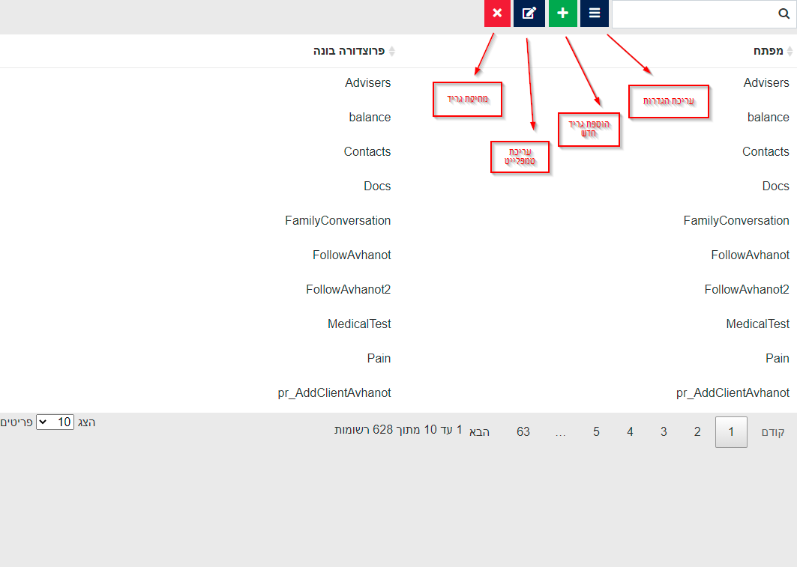

# מסך ניהול גרידים (מחולל אוטומטי)

שם הדף של המסך ניהול גרידים הוא GridsManager.aspx, אין לו לינק ישירות מהמערכת, וצריך להכניס אותו בשורת הכתובת.

היכולות שקיימות במסך:

* יצירת גריד חדש, כולל הגדרות וטמפלייט
* תצוגה מקדימה של גריד
* יצירה ומחיקה של גרידים

תמונה מהמסך:

&#x20;

עריכת הגדרות:

המזהה נועד בשביל להעביר לפקד של הגריד בתור Key, במקום להעביר לו את השמות של הפרוצדורות, לדוגמה:

`<puz:AdvancedGridNew runat="server" id="demo" Key="בדיקה2" />`

בעת יצירת גריד חדש, המשתמש יתבקש להכניס את המזהה\מפתח עבור הגריד החדש, ואת הפרוצדורה הבונה שלו, לאחר מכן ניתן לערוך את הגריד באמצעות כפתור עריכת ההגדרות ועריכת הטמפלייט.

עריכת טמפלייט:

כל אפשרויות בטמפלייט מקבילות להגדרות מטבלת tblGridViewTemplate

כמו כן, יש כלי עזר ע"מ לייצר את הדפוס אימות נתונים של השורה (ValidatorStatus):

.png>)

.png>)

במסך הזה בוחרים האם הפקד חייב להיות מספר\מחרוזת באורך מסוים\תאריך\שעה, וניתן להגביל את הטווח של הקלט לפי בחירה, וכמו כן לסמן האם השדה הוא שדה חובה.

